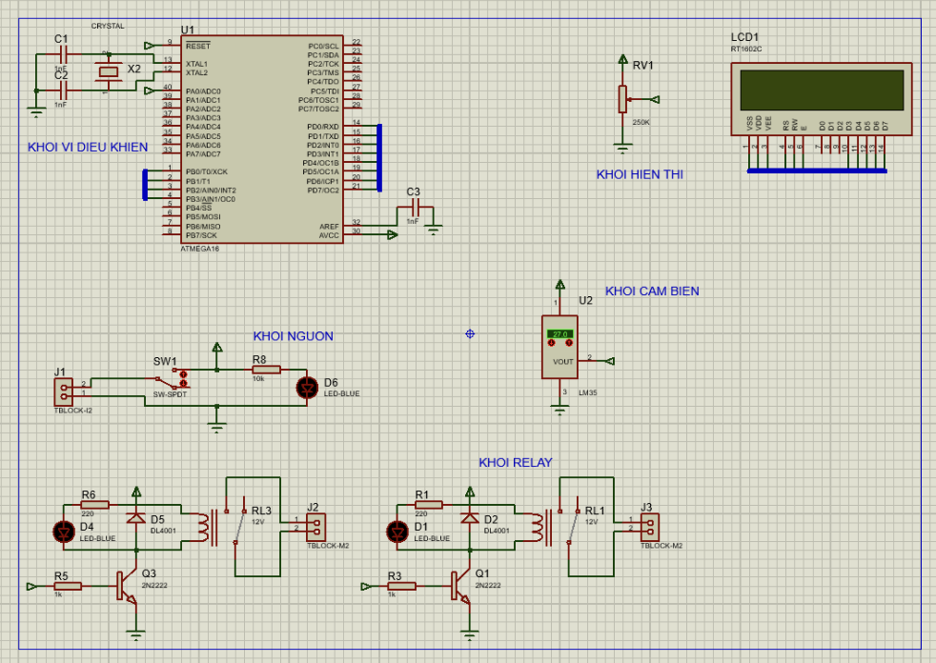

# ATmega16 Temperature Controller (LM35)

Bộ điều khiển nhiệt độ dùng vi điều khiển **ATmega16** và cảm biến **LM35**, viết bằng
**CodeVisionAVR**. Đọc nhiệt độ qua ADC, hiển thị lên LCD 16x2, và tự động bật/tắt
**quạt** và **đèn** qua relay theo ngưỡng nhiệt độ cài đặt.

## Tính năng

- Đọc nhiệt độ thực tế qua **ADC0 (PA0)** từ cảm biến **LM35** (10 mV/°C), Vref nội
  2.56V, độ phân giải 8-bit.
- **Mẹo thang đo:** `2.56V / 256 = 10 mV = đúng 1°C mỗi bước ADC`, nên giá trị `ADCH`
  đọc ra **chính là nhiệt độ °C** (dải 0–255 phủ tốt 0–100°C) — không cần công thức quy đổi.
- Hiển thị nhiệt độ **thực tế** và nhiệt độ **cài đặt** trên LCD 16x2.
- Điều khiển relay:
  - `temp > ngưỡng` → **bật quạt**, tắt đèn (làm mát).
  - `temp <= ngưỡng` → tắt quạt, **bật đèn** (sưởi).
- Cài đặt ngưỡng bằng 3 nút: UP / DOWN / RESET.
- Lưu ngưỡng cài đặt vào **EEPROM** → giữ nguyên sau khi mất điện.

## Sơ đồ chân

| Chân  | Chức năng                         |
|-------|-----------------------------------|
| PA0   | Đầu vào ADC (cảm biến nhiệt độ)    |
| PB0   | Nút UP — tăng ngưỡng              |
| PB1   | Nút DOWN — giảm ngưỡng            |
| PB2   | Relay FAN (quạt) — output         |
| PB3   | Relay LIGHT (đèn) — output        |
| PB4   | Nút RESET — về mặc định (25°C)    |
| PORTC/PORTD | LCD 16x2 (theo cấu hình CodeWizard) |

> PB0, PB1, PB4 dùng điện trở kéo lên nội (active-low — nhấn = mức 0).

## Sơ đồ mạch (Proteus)



Sơ đồ gồm các khối: vi điều khiển (ATmega16 + thạch anh), hiển thị (LCD1602 +
biến trở chỉnh tương phản), cảm biến (LM35), nguồn (công tắc + LED báo) và relay
(2 relay 12V kích qua transistor 2N2222 cho quạt/đèn).

## Cấu trúc thư mục

```
atmega-temperature-controller/
├── README.md
├── src/
│   └── main.c                  # Mã nguồn chính
└── docs/
    ├── hardware.md             # Mô tả phần cứng & ghi chú
    └── images/
        └── proteus-schematic.png   # Sơ đồ nguyên lý Proteus
```

## Biên dịch

Dự án dùng các thư viện riêng của CodeVisionAVR (`io.h`, `alcd.h`, `delay.h`).

1. Mở **CodeVisionAVR**, tạo project mới (hoặc dùng CodeWizardAVR).
2. Chọn chip **ATmega16** (kit hỗ trợ cả ATmega32 cùng chân đế) và tần số thạch anh.
3. Thêm `src/main.c` vào project.
4. Cấu hình LCD theo bảng chân ở trên, bật ADC với Vref nội 2.56V, ADLAR.
5. Build → nạp file `.hex` xuống chip (qua USBasp / mô phỏng Proteus).

## Ghi chú

- Với cấu hình **Vref 2.56V + 8-bit + LM35**, `ADCH` đọc ra trực tiếp là °C
  (1 LSB = 10 mV = 1°C). Nếu đổi Vref hoặc cảm biến khác thì phải đổi công thức quy đổi.
- LM35 chỉ đo dương (0°C trở lên); cấp nguồn 5V cho LM35, chân OUT nối PA0/ADC0.
- Ký tự `°` dùng mã `\xDF` của bộ ký tự HD44780 trên LCD.


